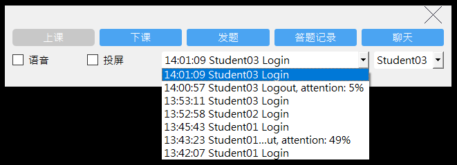

<!--
 * @Author: Helin 59716259+HelinXu@users.noreply.github.com
 * @Date: 2022-11-22 12:37:54
 * @LastEditors: Helin 59716259+HelinXu@users.noreply.github.com
 * @LastEditTime: 2022-11-22 13:17:02
 * @FilePath: /ThunderClassroom/README.md
 * @Description: 这是默认设置,请设置`customMade`, 打开koroFileHeader查看配置 进行设置: https://github.com/OBKoro1/koro1FileHeader/wiki/%E9%85%8D%E7%BD%AE
-->
# ThunderClassroom: An online meeting program

**Final project of C++ Program Design and Training (Graded A+)**

Instructor: Jingtao Fan

Author: Helin Xu

Thunder Class has basic functions of Zoom, including logging-in, screen-sharing, voice-sharing, group-chat and private-chat, problem-assigning and so on.

## Key Features

### User Login

User registration and login for Admin, Teacher, Student.

    

Fig. Login and user registration.

### Voice device selection and switching

Automatically select the default audio and microphone devices.

### Screen sharing

Allow teacher-side programs to share screens and live stream to multiple students.

    

Fig. Screen sharing

### Live Voice Broadcasting

Allow teacher-side programs to share voice and live stream to multiple students.

### Random text questions

Allows the teacher-side program to edit exercises and send them to students. You can choose to send them to all students, or to randomly send them to one student.

     

Fig. Teacher side, edit and send out questions. Student side, answer questions.

### Online Question Answering

The student-side program receives the exercises sent by the teacher in real time and allows students to answer the questions and send the answers back.

    

Fig. Question time-up

### Student Check-in

Teacher side program can count students' attendance and see when they check in or drop out.

### Attention

Teacher-side program can count students' attention and detect whether students are playing the lesson in the background.

    

Fig. Student check-in status and attention

### Class start / Class dismissal

The teacher-side program can start a course and dismiss it. After the course is dismissed, the teacher application can generate statistics on the correct answer rate, student attendance, online chat history, etc.

### Online chatting

The Thunder Class supports online chatting, both private chat and public chat.

    

Fig. Online chatting
